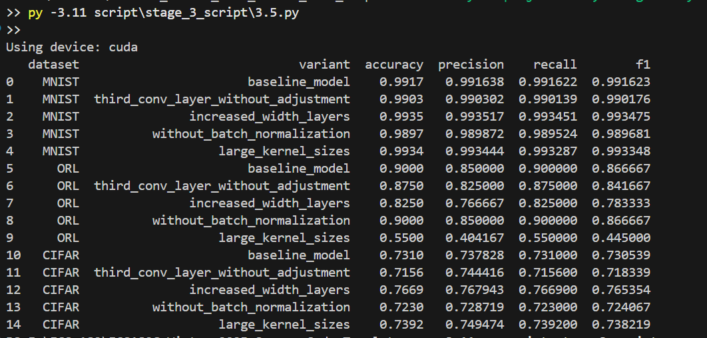

# deepLearning

#### Stage 3 is done:
#### Implementation link




## Directory Structure

```text
<project-root>/
├── data/
│   └── stage_3_data/
│       ├── MNIST
│       ├── ORL
│       └── CIFAR
├── local_code/
│   └── stage_3_code/
│       └── stage3.py
├── script/
│   └── stage_3_script/
│       ├── run.py
│       └── 3.5.py
└── result/
    └── stage_3_result/   ← outputs will land here
---


how to run:
python -m script.stage_3_script.run \
    --epochs 10 \
    --epochs-cifar 30


and 
python script/stage_3_script/3.5.py
![image.png]

#### Stage 2 is done


